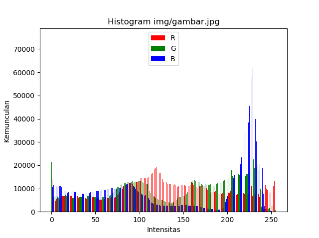

# Histogram

**Farhan Furqan**  
**09021281722045**  
**Teknik Informatika Reg 5A**

Cara membuat histogram citra menggunakan bahasa Python.                               
Library yang dipakai :                                                 
- matplotlib
- PIL (Python Image Library)

Kedua module di atas bisa di Install menggunakan command berikut:

```
pip3 install matplotlib pillow
```

## Program

Berikut Program Histogram
```python
from matplotlib import pyplot
from os.path import basename
from os.path import splitext
from PIL import Image

def get_file_name(file_path):
    return splitext(basename(file_path))[0]

def tampilkan_histogram(r, g, b, gambar):
    intensitas = list(range(256))
    lebar_bar = 0.3

    intensitas = [i-lebar_bar for i in intensitas]

    pyplot.bar(intensitas, r, width=lebar_bar, color='r')

    intensitas = [i+lebar_bar for i in intensitas]
    pyplot.bar(intensitas, g, width=lebar_bar, color='g')

    intensitas = [i+lebar_bar for i in intensitas]
    pyplot.bar(intensitas, b, width=lebar_bar, color='b')

    pyplot.title('Histogram ' + gambar)
    pyplot.xlabel('Intensitas')
    pyplot.ylabel('Kemunculan')
    pyplot.legend(['R', 'G', 'B'])
    pyplot.show()

def histogram(gambar):
    GAMBAR = Image.open(gambar)
    PIXEL = GAMBAR.load()

    ukuran_horizontal = GAMBAR.size[0]
    ukuran_vertikal = GAMBAR.size[1]

    gambar_r = Image.new('RGB', (ukuran_horizontal, ukuran_vertikal))
    pixel_r = gambar_r.load()

    gambar_g = Image.new('RGB', (ukuran_horizontal, ukuran_vertikal))
    pixel_g = gambar_g.load()

    gambar_b = Image.new('RGB', (ukuran_horizontal, ukuran_vertikal))
    pixel_b = gambar_b.load()

    r = [0] * 256
    g = [0] * 256
    b = [0] * 256

    for x in range(ukuran_horizontal):
        for y in range(ukuran_vertikal):
            intensitas_r = PIXEL[x, y][0]
            intensitas_g = PIXEL[x, y][1]
            intensitas_b = PIXEL[x, y][2]
            r[intensitas_r] += 1
            g[intensitas_g] += 1
            b[intensitas_b] += 1
            pixel_r[x, y] = (intensitas_r, 0, 0)
            pixel_g[x, y] = (0, intensitas_g, 0)
            pixel_b[x, y] = (0, 0, intensitas_b)

    gambar_r.save('img/' + get_file_name(gambar) + '_R.jpg')
    gambar_g.save('img/' + get_file_name(gambar) + '_G.jpg')
    gambar_b.save('img/' + get_file_name(gambar) + '_B.jpg')

    tampilkan_histogram(r, g, b, gambar)

histogram('img/gambar.jpg')
```

Gambar Sampel:                                                          

                                           
[](img/gambar.jpg)

Hasil Histogram:                                                     



#### Komposisi RGB

R | G | B
--- | - | -
 |  | 